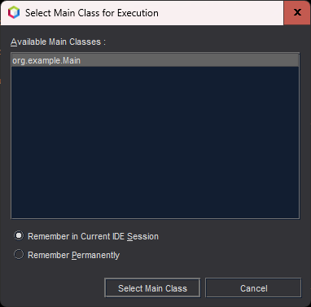

# Trab2024bim1Kenji

## Participantes:

| Nome           |     R.A. |
|----------------|---------:|
| Kenji Sousa    | 255114-1 |

## Importante:
O projeto foi criado com o IntelliJ IDEA.  
Caso seja aberto em uma IDE como o NetBeans, será necessário configurar a classe principal a ser executada.  
Isso já é feito automaticamente pelo NetBeans ao executar o projeto  

